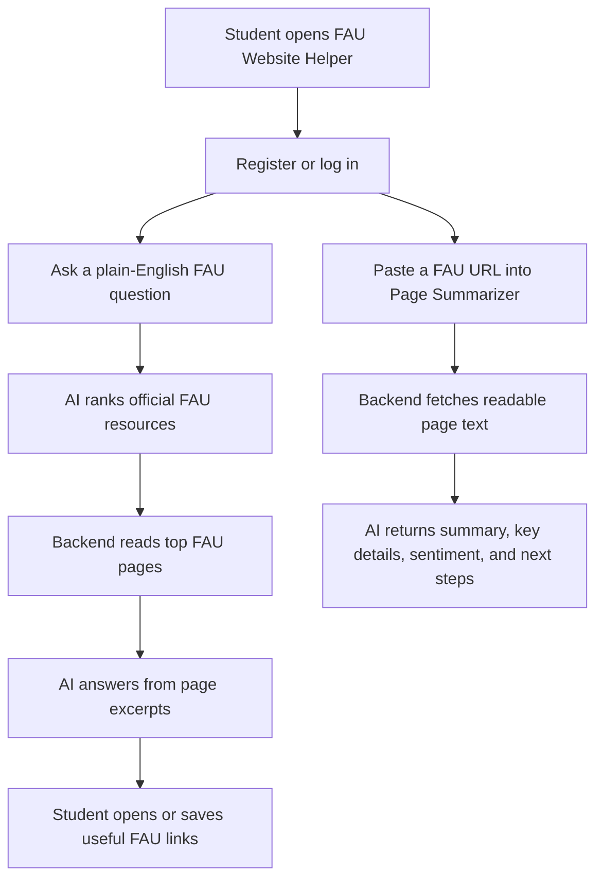

# Planning Notes

## User Flow



## Wireframe

```text
+--------------------------------------------------------------+
| FAU Website Helper                         [Sign out]         |
+-------------------------------+------------------------------+
| What are you trying to find?   | Page summarizer              |
| [question input] [Find]        | [FAU URL input]              |
|                               | [optional pasted text]       |
| AI answer from page content    | [Summarize]                  |
|                               | Summary / details / steps    |
| Ranked official FAU pages      |                              |
| [Open] [Save] cards            |                              |
|                               |                              |
| Saved FAU links CRUD           |                              |
+-------------------------------+------------------------------+
```

## Database Schema

Supabase Auth stores users. The app stores saved FAU links in `public.saved_resources`.

See `docs/DATABASE_SCHEMA.sql` for the table, trigger, and RLS policies.

## API Architecture

- React frontend calls Express routes under `/api`.
- Express handles validation, auth checks, rate limiting, and AI calls.
- Supabase Auth manages registration/login/session verification.
- Supabase Postgres persists saved resources with full CRUD.
- OpenAI powers FAU resource matching, page-based answers, and summarization.
- Vercel serves the frontend and API through `api/index.js`.
